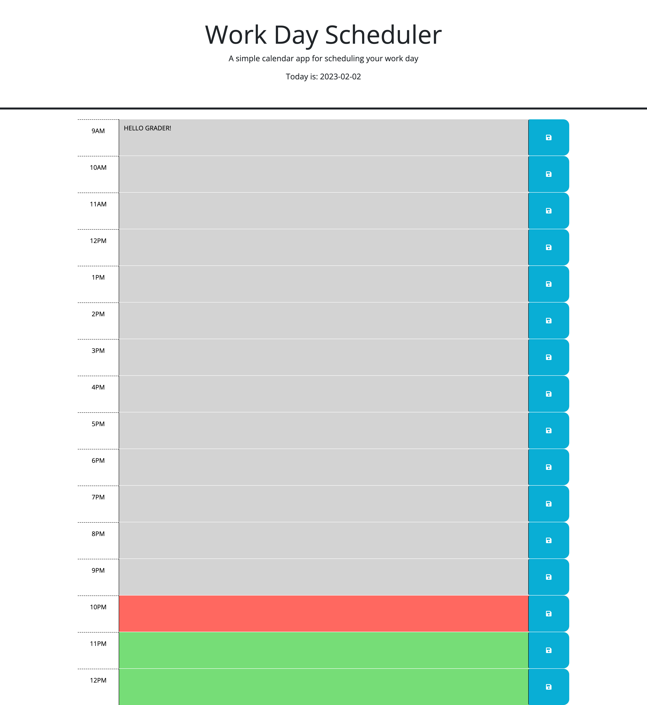

# whats-on-the-agenda
A simple calendar application that allows a user to save events for each hour of the day. This program runs in the browser and uses jQuery to alter the HTML and CSS.

## Description

An application that anyone can use to manage their workday schedule.

- My goal for this project was to design a workday calendar that displays the hours of the day, the current date, and allows users to enter their own information and save it on the page even when it is refreshed.
- This project taught me a great deal about third-party APIs and preserving data in local storage. I learned how to use Day.js, which allows the page to display current dates and times. I also learned how to set the page to refresh and save data by default. I discovered how to color code the time blocks to signify past, present, and future time based on the current time of day. Plus so much more!

## Link to Live WebPage

https://marleyschneiderr.github.io/whats-on-the-agenda/

## Installation

N/A

## Authors

Created by Marley Schneider, Github: https://github.com/marleyschneiderr

## Usage

This website was designed to serve as a organizer for a busy work day. This quiz is available for all people who would like to organize their workday and life around it.

## Credits

Created by Marley Schneider

Starter Code is from EDX Bootcamps, originating from the University of Washington full stack coding bootcamp.

## License

Please refer to the LICENSE in the repo.

